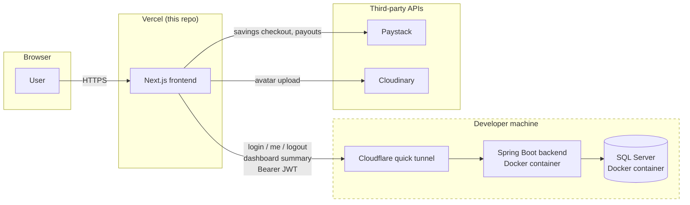

# T-Coop — Current State (Everything We Have, In One File)

Snapshot of what's actually built today. This merges `README.md` and every
file under `documentation/` into one place — those files still exist and go
deeper on any one topic, but this is the single-file version.

**A real Java backend now exists** ([t-coop-backend](https://github.com/turontechnologies/t-coop-backend),
sibling repo) and is wired up for **login/logout and the dashboard
summary** — see [Backend Integration](#backend-integration) below. Every
other flow still runs against hardcoded mock data / in-memory Zustand
stores, **except** Paystack (payments, bank verification, payouts) and
Cloudinary (photo upload), which are genuinely real, working integrations
already. See [API contracts](./api-contracts.md) for the endpoints the
backend still needs to expose.

---

## Tech Stack

Next.js 15 (App Router) · React 19 · TypeScript · Tailwind CSS v4 ·
shadcn/ui (on [Base UI](https://base-ui.com), not Radix) · TanStack Query ·
React Hook Form + Zod · Zustand · Framer Motion · Recharts · next-themes

## Roles & Demo Accounts

Three hardcoded roles, no public sign-up — a super admin creates new
co-operatives from `/co-operatives`, that's the only "onboarding" path.

| Role        | Membership ID | Password   | Lands on                        |
| ----------- | ------------- | ---------- | ------------------------------- |
| Super Admin | `SA-0001`     | `admin123` | `/dashboard` (super admin view) |
| Admin       | `COOP-0001`   | `admin123` | `/dashboard` (admin view)       |
| Member      | `MB-0001`     | `admin123` | `/dashboard` (member view)      |

**A co-op's admin logs in with the co-op's own ID** — there's no separate
`AD-XXXX` admin ID. Onboarding a co-op from `/co-operatives/new` provisions
exactly one admin account whose membership ID is the co-op's own ID, default
password `admin123`. `COOP-0001` above is the demo co-op seeded by the
backend (`V2`/`V3`/`V4`, renamed onto this scheme by `V7`).

The offline mock login (`src/lib/mock-users.ts`,
`NEXT_PUBLIC_USE_MOCK_LOGIN=true`) still predates this and uses its own
`AD-0001`/non-`admin123` credentials — it's a standalone fallback for
demoing with no backend running at all, not something this cutover touches;
see that file's own "remove once real auth lands" comment. Against the real
backend (`NEXT_PUBLIC_USE_MOCK_LOGIN=false`, the current default), only the
table above applies. Mock passwords are mutable at runtime (the
password-recovery flow genuinely
changes them in-memory) but reset on a full page reload; the real backend
has no working password-reset endpoint yet (see Auth above).

- **Super Admin** — oversees every co-operative on the platform.
- **Admin** — manages the members, savings, and loans of the one
  co-operative they run.
- **Member** — manages their own savings, loans, and profile.

## What's Real vs. Mocked

| Integration                                                               | Status                                                                       | Where                                                         |
| ------------------------------------------------------------------------- | ---------------------------------------------------------------------------- | ------------------------------------------------------------- |
| Paystack Inline (savings deposit checkout)                                | **Real** — needs a test-mode public key                                      | `NEXT_PUBLIC_PAYSTACK_PUBLIC_KEY`                             |
| Paystack bank-account verification                                        | **Real** — needs a test-mode secret key                                      | `PAYSTACK_SECRET_KEY`, `src/app/api/paystack/resolve-account` |
| Paystack live bank list                                                   | **Real**                                                                     | `src/app/api/paystack/banks`                                  |
| Paystack Transfers (loan disbursement, savings withdrawal payout)         | **Real**                                                                     | `src/app/api/paystack/transfer`, `/transfer/finalize`         |
| Cloudinary profile-photo upload                                           | **Real** — needs `CLOUDINARY_*` env vars                                     | `src/app/api/upload`                                          |
| Country/State/City cascade                                                | **Real** — free public API, called directly from the browser                 | `src/lib/geo-lookup.ts` (countriesnow.space)                  |
| IP geolocation for the audit log                                          | **Real** — free public API, called directly from the browser                 | `src/lib/ip-location.ts` (ipwho.is)                           |
| Live currency conversion rates                                            | **Real** — free public API, polled every 5 min                               | `src/lib/exchange-rate.ts` (open.er-api.com)                  |
| Login / `/auth/me` / logout                                               | **Real** — calls `t-coop-backend`, JWT bearer auth                           | `src/services/auth.service.ts`, `src/lib/axios.ts`            |
| Dashboard cards + Recent Activities                                       | **Real** aggregates; chart/dividends still illustrative                      | `src/services/dashboard.service.ts`                           |
| Profile (view/edit, all roles) — `/profile` and `/settings` → Profile tab | **Real** — `GET`/`PATCH /profile` + `POST /profile/password`                 | `src/services/profile.service.ts`                             |
| Payment Settings + Integrations (super admin)                             | **Real** — `GET`/`PATCH /settings/{fees,collection-account,integrations}`    | `src/services/platform-settings.service.ts`                   |
| Audit log — Settings' Logs tab (super admin)                              | **Real** — `GET /audit-log`; covers Authentication + Settings actions so far | `src/services/audit-log.service.ts`                           |
| Everything else (members, savings/loan records, notices, subscriptions)   | **Mocked** — in-memory only, resets on reload                                | `src/lib/*-data.ts`, `src/store/*.store.ts`                   |

Two known real-world constraints discovered while building the payout
integration (not app bugs): Paystack's test mode caps real-bank-account
resolves at 3/day (bank code `001` "Test Bank" works around this for
verification only, not for actual payouts), and an actual Transfer needs
the connected Paystack business account to be past "Starter" tier
(`"You cannot initiate third party payouts as a starter business"` — a
Paystack KYB/business-verification requirement, not something fixable in
code). Full detail in [payments-and-payouts.md](./payments-and-payouts.md).

---

## Feature Areas

### Auth (`/login`, `/forgot-password`, `/verify-otp`, `/create-new-password`)

Split-screen `/login` (Membership ID + Password, not email). **Login,
`/auth/me`, and logout now call the real backend** (`src/services/auth.service.ts`,
`src/lib/axios.ts` attaches the JWT as `Authorization: Bearer <token>` on
every request) — falls back to the old mock accounts if
`NEXT_PUBLIC_USE_MOCK_LOGIN=true`. Password-reset loop (request OTP by
email → verify 6-digit code → set new password) is still mocked
(`NEXT_PUBLIC_USE_MOCK_PASSWORD_RESET=true`) since the backend doesn't
implement forgot-password yet — OTP is currently just handed back to the
client, a real backend must email it instead and never return it. OTP is
**not** part of primary login — only the reset flow.

**Any 401 from any backend call (except a failed login attempt itself)
auto-redirects to `/login`** — handled once, centrally, in `src/lib/axios.ts`'s
response interceptor: clears the Zustand auth store and hard-redirects, so
an expired/invalid token on any page recovers cleanly instead of leaving a
broken page with silently-failing requests. The same interceptor also
unwraps the backend's `{"error": "..."}` shape into a real `Error`, so every
existing `error.message` / `toast.error(...)` call site across the app
already shows the actual backend message — this is also what makes the
duplicate-email message on Profile (see below) show up correctly.

### Dashboard (`/dashboard`)

One route, one layout, shared by all three roles — content (quick-summary
cards, activity chart, recent activity list) reconfigures per role.
**Cards and Recent Activities are now real**, fetched from the backend's
`GET /dashboard/summary` (`src/services/dashboard.service.ts`,
`src/hooks/use-dashboard-summary.ts`) and aggregated from actual
`savings_records`/`loan_records`. The hourly chart and the "Dividends"
figure have no dedicated ledger behind them yet, so the backend derives
them from the real totals rather than inventing them outright — see
[Backend Integration](#backend-integration) below and
`t-coop-backend/documentation/flows.md` for exactly what's real vs.
illustrative. Falls back to the old static mock if
`NEXT_PUBLIC_USE_MOCK_DASHBOARD=true`.

### Profile (`/profile` for admin/member; super admin's own profile lives at `/settings` → Profile tab instead)

Read-only by default, "Edit" toggles a form. **Backed by the real backend**
(`GET`/`PATCH /profile`) — fetched via `useProfile`, saved via
`useUpdateProfile`, with a loading skeleton and a retry-able error state if
the fetch fails. Falls back to the old mock if
`NEXT_PUBLIC_USE_MOCK_PROFILE=true`. Real Cloudinary photo upload. Bank
Account section (bank picker + account number + "Verify" button that calls
real Paystack resolve, shows the resolved account holder name) — this
replaced an earlier BVN field entirely. Country/State/City via the live
cascading dropdown. The backend rejects a duplicate email with a real,
specific message ("That email address is already in use by another
account", 409) instead of a generic 500 — checked proactively before the
save, with a `DataIntegrityViolationException` handler as a defense-in-depth
fallback for the same unique constraint.

The topbar's "My Profile" menu item is role-aware
(`dashboard-topbar.tsx`): super admin goes to `/settings` (its Profile tab
is the primary place super admin manages their own details, alongside
password change), admin/member go to the standalone `/profile` page. Both
destinations read/write the same backend record — `/settings`' Profile tab
only edits a subset of fields (name/email/address/phone/country) and
merges those onto the full fetched record before saving, so it can never
wipe out fields it doesn't show (NIN, bank account, gender, state/city).

### Savings & Contributions (`/savings`)

- **Member**: real Paystack checkout for a new deposit, request a
  withdrawal (goes to admin for approval), savings-record detail page.
- **Admin**: Quick Summary, "Members Savings" (by-type breakdown →
  per-type record table → record detail) / "My Savings" / "Request"
  tabs, manual teller-upload with receipt attachment, approve/decline
  deposit or withdrawal requests — approving a withdrawal triggers a
  **real** Paystack payout to the member's saved bank details (never
  marks Approved if the transfer fails).
- **Super Admin**: `/savings` now shows a real oversight page — Quick
  Summary (Total Savings + an illustrative Transaction Fees Received
  figure, 0.25% of volume, clearly not a real fee ledger), a table of
  every co-operative with its savings totals, clicking a row deep-links
  into that co-op's existing Savings tab. (Loans doesn't have this
  super-admin top-level view yet — see Loans below.)

Filter-by-savings-type is available everywhere records are listed
(records tables and the Requests tabs, both admin and member).

### Loans (`/loans`)

- **Member**: eligibility-gated "Take a Loan" flow (amount is validated
  against a live-computed max before you can even type past it), live
  cost preview, repayment schedule + transactions detail page.
- **Admin**: Quick Summary, "Requests" (guarantor-accept/reject with
  payslip upload → admin approve/reject-with-reason) / "Members Loans" /
  "My Loans" tabs. Approving triggers a real Paystack payout the same way
  savings withdrawal does.
- **Super Admin**: nav item still has no dedicated `/loans` view — the
  equivalent oversight already exists per co-operative under
  `/co-operatives/[id]/loans/...`, same situation Savings was in before
  this session's work gave it a real top-level page.

Two loan status models currently exist side by side and aren't unified:
the member's own simple `LoanRecord` (`Active|Awaiting Approval|
Completed|Rejected`, no guarantor step, never resolved by an admin
action) vs. the richer co-op-scoped `CoopLoanRecord` (adds
`Awaiting Guarantor`/`Awaiting Admin`, the real approval pipeline). A real
backend should standardize on the richer one.

### Co-operatives (`/co-operatives`, super admin only)

Wired to the real backend (`NEXT_PUBLIC_USE_MOCK_COOPERATIVES=false`): list
every co-op with real member counts and savings/loans totals, add a new one
(duplicate co-op ID / duplicate email both checked server-side, no "pending
review" queue — the super admin _is_ the approval authority), edit, and
enable/disable. Onboarding a co-op provisions its admin login too — the
co-op logs in with its own ID and the platform default password
(`admin123`); see [Roles & Demo Accounts](#roles--demo-accounts) above and
`t-coop-backend/documentation/flows.md`'s co-operative onboarding section.
Editing a co-op's admin name/email/phone here updates the same row that
admin logs in and self-edits as, so the change shows up on their own portal
immediately. Disabling a co-op locks its admin out of login with a friendly
"account not active" message.

Drill down: co-op → Members/Savings/Loans tabs → individual
member/savings-type/loan-type → individual record detail — that part is
still not wired to a real backend (see
[Backend Integration](#backend-integration)), so those tabs render an
honest empty state for a real co-op rather than fake mock data. This
replaced the old public `/register` route entirely — co-operatives are
admin-created, not self-service.

### Members Directory (`/members`, admin only)

The admin's own co-op's member list: add (with the same real bank-account
verification step as Profile), bulk import via an Excel template, export,
edit (including bank details), activate/disable, per-member detail with
their own Savings/Loans tabs. Currently hardcoded to one fixed co-op ID
(`ADMIN_DIRECTORY_COOP_ID`) standing in for "the admin's own co-op" —
real auth/session data should replace that once a backend exists.

### Notice Board (`/notice-board`, all roles)

Create a notice (General / Meeting Notice with a date / Meeting Minutes
with a PDF attachment), choose recipients (All Members / All Admins /
All Members & Admins) and medium (Email / SMS / both, simulated), send
now or schedule. Real cross-tab real-time sync via the browser `storage`
event (not a server push — works across tabs in the same browser only,
not across devices/users, since there's no backend). Reply thread, live
notification bell, resend, delete.

### Subscriptions (`/subscriptions`, super admin only)

Every co-operative's subscription standing at a glance: Quick Summary
(Mgt Fees Received — total across all co-ops), a table (Co-op ID, Co-op
Name, Revenue Earned, Subscription Fee, Date of last payment, Active/
Overdue status) with search + status filter + date range, "Manual
Upload" to record a payment for any co-op. Clicking a row drills into
`/subscriptions/[id]` — a `SubscriptionCoopHeaderCard` with the same field
layout as `/co-operatives/[id]`'s real `CoopHeaderCard` (Co-op ID/Name/
Contact/Admin/Address/Total Savings/Total Loan + Disable Co-operative), kept
as a separate component since Subscriptions is still fully mock-store-backed
and hasn't been cut over to the real backend — plus that one co-op's full
"Subscription History" table and its own Manual Upload. No real payment
gateway here (money coming _in_ from a co-op, recorded manually, not a
Paystack flow) — see [subscriptions-page.md](./subscriptions-page.md).

### Settings (`/settings`, super admin + admin — role-branched)

**Super admin** gets five tabs — this is where super admin manages their
own profile day-to-day (the topbar's "My Profile" link brings them here
directly): **Profile** (avatar, name/email/address/phone/country — **real**,
fetched/saved via `GET`/`PATCH /profile`, same backend record `/profile`
itself reads; the optional inline password change is **real** too —
`POST /profile/password` via `useChangePassword`, verifies the current
password server-side, saved as a separate call right after the profile
fields so a wrong-current-password failure never loses profile edits that
already succeeded — password fields here, and every other password/secret
field in the app (login, password reset, integration API secrets), use the
shared `PasswordInput` component (`src/components/ui/password-input.tsx`)
for its show/hide eye-icon toggle). **Payment Settings** — **real**,
`GET`/`PATCH /settings/fees` and `/settings/collection-account` — Fees &
Charges (savings/loan charge type + amount) and Account Details (the
platform's own collections bank account, real Paystack resolve — but
auto-triggered the moment a bank is picked and the account number hits 10
digits, no manual "Verify" click; Save Changes stays disabled until that
resolves successfully, so there's no way to save an unverified account).
**Integrations** — also **real**,
`GET`/`PATCH /settings/integrations` — Paystack and Flutterwave as two
fully independent toggles (either, both, or neither), each with its own
credential fields (now with the show/hide eye toggle too), persisted
server-side (the live Paystack integration still reads its keys from the
server environment; Flutterwave has no live route handler behind it yet —
saving these values here never changes that). All three tabs share one
backend singleton row and fall back to the old `useSettingsStore` mock if
`NEXT_PUBLIC_USE_MOCK_SETTINGS=true`; loading/retry-able-error states use
the new shared `QueryBoundary` component
(`src/components/features/shared/query-boundary.tsx`), the same pattern
now used by Profile, Dashboard, Logs, and these three tabs.
**User Management** — platform staff accounts and roles (distinct from
co-operative members), each row fully actionable: edit (role for
users, name/permissions for roles), disable/activate, remove (role
removal is blocked while a user is still assigned to it). **Logs** — a
searchable, platform-wide audit trail. **Now backed by the real backend**
(`GET /audit-log`, super-admin-only, 403s for anyone else — enforced
server-side, not just hidden in the UI) via `useAuditLog()`, with a loading
skeleton and retry-able error state, viewable in full via a slide-in
Activity Details panel. Only real actions show up here now: logins/logouts
and profile updates. Co-operatives/Members/Savings/Loans/Subscriptions/
Notices actions are still mock-only (still write to the local
`logActivity()`/`useAuditLogStore` used before this cutover) and won't
appear in this real log until those features get their own backend
cutover. `MODULE_ICONS`/`ACTION_ICONS`/`STATUS_STYLES` are indexed via
`getModuleIcon`/`getActionIcon`/`getStatusStyle` (`src/lib/audit-log-ui.ts`)
rather than direct object lookups — a `module`/`action`/`status` value the
frontend doesn't recognize (a real bug that happened once, from historical
rows written before the backend's naming was fixed to match) now falls
back to a neutral icon instead of crashing the whole tab. See
[settings-page.md](./settings-page.md).

**Admin** gets a different five tabs, reflecting one co-operative's
day-to-day operations rather than the whole platform: **Profile** (User
sub-tab reuses the exact same component super admin's Profile tab uses;
Bank Accounts is the admin's own personal payout account, same
`ProfileRecord` fields `/profile` manages). **Savings Settings** and
**Loan Settings** — real, working CRUD over the co-op's savings/loan
product catalog (seeded from the same `SAVINGS_TYPES`/`LOAN_TYPES`
constants used everywhere else, honestly not yet wired back into them —
same "illustrative settings" pattern as super admin's Fees & Charges);
new/edit a loan type is a full page
(`/settings/loans/new`, `?id=` for edit) since that form has far more
fields than a modal comfortably holds. **Co-operative Settings** — the
co-op's own profile + committee members, its own bank account
(Co-operative/Bank Accounts sub-tabs), and its **currency** — a
searchable picker over ~160 real ISO 4217 currencies, writing directly
to the real `Cooperative` record (not the illustrative settings pattern
above — this one needs to be genuinely visible to the super admin, so
it can't live in a disconnected sandbox). **User Management** — the
exact same component super admin uses (platform staff is currently
shared between the two roles, not per-co-operative). See
[admin-settings-page.md](./admin-settings-page.md) and
[currency-conversion.md](./currency-conversion.md).

Not yet extended to the member role.

### Payments & Payouts (cross-cutting)

Covered under Savings/Loans above and Profile/Members Directory's bank
verification step — full technical detail (route handlers, request/
response shapes, the real Paystack constraints discovered) lives in
[payments-and-payouts.md](./payments-and-payouts.md).

---

## Backend Integration

A real Java (Spring Boot) + MSSQL backend lives in the sibling
[t-coop-backend](https://github.com/turontechnologies/t-coop-backend) repo.
While Azure access is pending, it runs locally in Docker and is exposed
publicly through a Cloudflare quick tunnel — see that repo's
`documentation/deployment.md` for the honest limits of that setup (the URL
changes every time the tunnel restarts, no uptime guarantee).



Auth (login/me/logout), the dashboard summary, profile, the audit log, and
platform settings (Fees & Charges / Account Details / Integrations) are cut
over so far — everything else in the table above (members,
savings, loans, notices, subscriptions) still reads/writes the in-memory
Zustand stores. Each
feature's cutover follows the same one-step pattern: point its
`*.service.ts` at the real endpoint, gate it behind its own
`NEXT_PUBLIC_USE_MOCK_*` flag so it can still be demoed without the
backend running, remove the flag once the backend is stable enough not to
need a fallback.

See `t-coop-backend/documentation/flows.md` for sequence diagrams of the
auth and dashboard-summary request flows, and
`t-coop-backend/documentation/schema-design.md` for the database ER
diagram.

## Core Data Models (current, in-memory)

```ts
// Auth
type UserRole = "super_admin" | "admin" | "member";
interface AuthenticatedMember {
  id: string;
  name: string;
  email: string;
  role: UserRole;
  avatarUrl?: string;
}

// Cooperative + nested member/savings/loan records
interface Cooperative {
  id: string;
  name: string;
  adminName: string;
  contactEmail: string;
  contactPhone: string;
  address: string;
  country: string;
  state: string;
  city: string;
  status: "Active" | "Disabled";
  members: CoopMember[];
  savings: CoopSavingsRecord[];
  loans: CoopLoanRecord[];
  savingsRequests: SavingsRequest[];
  subscriptionFee: number;
  subscriptionPayments: CoopSubscriptionPayment[];
}
interface CoopSubscriptionPayment {
  id: string;
  paymentRef: string;
  amountPaid: number;
  method: "Manual" | "Paystack";
  date: string;
  narration: string;
  status: "Active" | "Overdue"; // subscription standing as of this payment
}
interface CoopMember {
  id: string;
  firstName: string;
  lastName: string;
  email: string;
  role: "Admin" | "Member";
  status: "Active" | "Inactive";
  guarantor: string;
  country: string;
  state: string;
  city: string;
  bankCode: string;
  accountNumber: string;
  accountName: string;
}
interface CoopSavingsRecord {
  id: string;
  memberId: string;
  memberName: string;
  savingsType: string;
  amount: number;
  balanceAfter: number;
  method: "Paystack" | "Manual Upload";
  transactionId: string;
  date: string;
  status: "Success" | "Pending" | "Failed";
  receiptUrl?: string;
}
interface SavingsRequest {
  id: string;
  memberId: string;
  memberName: string;
  type: "Deposit" | "Withdrawal";
  savingsType: string;
  amount: number;
  note?: string;
  status: "Pending" | "Approved" | "Declined";
  requestedAt: string;
  resolvedAt?: string;
}
interface CoopLoanRecord {
  id: string;
  memberId: string;
  memberName: string;
  loanType: string;
  amount: number;
  interestRate: number;
  durationMonths: number;
  numberOfRepayments: number;
  monthlyRepayment: number;
  totalRepayment: number;
  guarantorName: string;
  date: string;
  status:
    | "Awaiting Guarantor"
    | "Awaiting Admin"
    | "Active"
    | "Completed"
    | "Rejected";
  repaymentsMade: number;
  guarantorDocumentUrl?: string;
  guarantorAcceptedAt?: string;
  rejectionReason?: string;
}

// Savings/Loan product catalogs (fixed, 3 of each)
interface SavingsTypeDef {
  name: string;
  min: number;
  max: number;
}
interface LoanTypeDef {
  name: string;
  interestRate: number;
  maxAmount: number;
  durationMonths: number;
  eligibilityPercent: number;
}

// Profile (self)
interface ProfileRecord {
  membershipId: string;
  accountNumber: string;
  bankCode: string;
  accountName: string;
  nin: string;
  firstName: string;
  lastName: string;
  otherName?: string;
  gender: "Male" | "Female" | "Other";
  phone: string;
  email: string;
  homeAddress: string;
  country: string;
  state: string;
  city: string;
  facebook?: string;
  twitter?: string;
  guarantor?: string;
}

// Notices
interface Notice {
  id: string;
  type: "General" | "Meeting Notice" | "Meeting Minutes";
  title: string;
  message: string;
  recipient: "All Members" | "All Admins" | "All Members & Admins";
  medium: "Email" | "SMS" | "Email & SMS";
  meetingDate?: string;
  attachment?: { name: string; dataUrl: string; size: number };
  sendAt: string;
  createdByName: string;
  createdByRole: UserRole;
  createdAt: string;
}
interface NoticeReply {
  id: string;
  noticeId: string;
  authorId: string;
  authorName: string;
  authorRole: UserRole;
  authorAvatarUrl?: string;
  message: string;
  createdAt: string;
}
```

---

## Routes

| Route                                                                                                                                                                       | Purpose                                                                                                                                 |
| --------------------------------------------------------------------------------------------------------------------------------------------------------------------------- | --------------------------------------------------------------------------------------------------------------------------------------- |
| `/login`                                                                                                                                                                    | Sign in with membership ID + password                                                                                                   |
| `/forgot-password`, `/verify-otp`, `/create-new-password`                                                                                                                   | Password recovery loop                                                                                                                  |
| `/dashboard`                                                                                                                                                                | Role-aware dashboard                                                                                                                    |
| `/profile`                                                                                                                                                                  | Own member details, editable, all roles                                                                                                 |
| `/savings`, `/savings/[id]`, `/savings/type/[type]`, `/savings/record/[recordId]`                                                                                           | Savings (member + admin + now super admin)                                                                                              |
| `/loans`, `/loans/[id]`, `/loans/type/[type]`, `/loans/record/[recordId]`, `/loans/request/[recordId]`                                                                      | Loans (member + admin)                                                                                                                  |
| `/co-operatives`, `/co-operatives/new`, `/co-operatives/[id]`, `/co-operatives/[id]/members/[memberId]`, `/co-operatives/[id]/savings/...`, `/co-operatives/[id]/loans/...` | Super admin oversight                                                                                                                   |
| `/members`, `/members/new`, `/members/[memberId]`                                                                                                                           | Admin's own member directory                                                                                                            |
| `/notice-board`, `/notice-board/new`, `/notice-board/[id]`                                                                                                                  | Announcements/meetings/minutes, all roles                                                                                               |
| `/subscriptions`, `/subscriptions/[id]`                                                                                                                                     | Super admin: subscription oversight                                                                                                     |
| `/settings`                                                                                                                                                                 | Role-branched: super admin (profile, fees, integrations, staff, logs) / admin (profile, savings & loan settings, co-op settings, staff) |
| `/settings/loans/new`                                                                                                                                                       | Admin: create/edit a loan type (full page)                                                                                              |
| `/api/upload`                                                                                                                                                               | Cloudinary avatar upload (real)                                                                                                         |
| `/api/paystack/resolve-account`, `/banks`, `/transfer`, `/transfer/finalize`                                                                                                | Paystack route handlers (real)                                                                                                          |

## Project Structure

```
src/
  app/
    (auth)/                  split-screen layout — /login
    (password-recovery)/     centered layout — forgot/verify/new-password
    (dashboard)/              role-aware dashboard, auth-guarded
                              (co-operatives/, members/, notice-board/ nested here)
    api/upload/               Cloudinary avatar upload
    api/paystack/             bank resolve, live bank list, transfer + finalize
  components/
    brand/                   logo, loading mark, route transitions
    features/{auth,coop,dashboard,loans,members-directory,notice-board,profile,savings,shared}/
    layouts/                 auth / centered / dashboard shells
    theme/                   next-themes provider + toggle
    ui/                      shadcn primitives (Base UI-based)
  config/                    role → nav item mapping
  hooks/                     one hook per mutation, small UI-timing hooks, cross-tab sync
  lib/                       mock data, validation schemas, small utilities
  services/                  auth/profile/etc. — the seam a real backend plugs into
  store/                     Zustand stores (auth session, password-reset session,
                              savings, loans, co-operatives, notice board, settings)
  types/                     shared domain types
```

## Status Checklist

- [x] Login (3 hardcoded roles, demo-account picker)
- [x] Forgot password → OTP → new password
- [x] Dashboard (super admin / admin / member views — figures are static, not real)
- [x] My Profile (real Cloudinary photo upload, real bank verification)
- [x] Savings & Contributions (member + admin + **super admin oversight, now built**)
- [x] Loans (member + admin; super-admin top-level view still pending — per-co-op view already covers it)
- [x] Co-operatives (super admin: list, add, edit, enable/disable — all real
      backend now; onboarding provisions a real admin login, the co-op's own
      ID; drill-down into a real co-op's Members/Savings/Loans tabs is
      still not wired, renders an honest empty state)
- [x] Members Directory (admin: list, add w/ bank verification, bulk import, export, edit, disable/activate)
- [x] Notice Board (all roles, real cross-tab real-time)
- [x] Real Paystack Transfers, bank verification, live bank list, live Country/State/City
- [x] Subscriptions (super admin: all co-ops' standing, revenue, manual payment upload with
      billing cycle, per-co-op history — all real backend now) — plus the platform-wide gate:
      no co-op can do anything until its subscription is paid, enforced server-side
- [x] Support (`/support`, admin only) — the co-op's own self-service subscription payment via
      real Paystack (Flutterwave selectable once the super admin enables it and enters real
      keys, but unverified — no sandbox credentials available to test against yet), a branded
      downloadable PDF receipt on every payment, and full transaction history with
      re-downloadable receipts. This is the one page a dormant admin can still reach — every
      other route redirects here until they renew
- [x] Settings (super admin: profile/password, fees & collections account, and
      Paystack/Flutterwave integration toggles — all backed by the real
      backend now; staff users/roles with full edit/disable/remove actions
      still mocked; real backend-backed audit log with server-resolved IP
      location, currently covers Authentication + Settings actions only,
      other modules still mock. admin: profile + personal bank, savings/loan
      type catalog CRUD, co-op profile + bank account + currency, shared
      staff management)
- [x] Per-co-op currency + live conversion rate (admin sets it, super admin sees it live everywhere a co-op shows up; every displayed savings/loans amount app-wide formats in that co-op's currency, isolated per co-op on the super-admin side, with cross-co-op aggregates genuinely converted and summed)
- [x] Light/dark theme
- [x] Real backend integration — login/me/logout, the dashboard summary,
      profile view/edit, the audit log, platform settings (Fees & Charges /
      Account Details / Integrations), and Co-operatives (list/add/edit/
      enable-disable) all call the real `t-coop-backend` (see
      [Backend Integration](#backend-integration)); the rest of
      `src/services/*.service.ts` is still mocked
- [x] Dashboard's real numbers — cards + Recent Activities are real
      aggregates; the hourly chart and Dividends figure are still
      illustrative (no dedicated ledger exists yet)
- [x] Any 401 from the backend (except a failed login attempt) auto-clears
      the session and redirects to `/login` — handled once, centrally, in
      `src/lib/axios.ts`
- [ ] Server-side Paystack transaction verification for Inline checkout (client callback trusted for now)
- [ ] Admin approval path for the member's own simple "Take a Loan" flow (stays "Awaiting Approval" forever — separate from the co-op guarantor pipeline)
- [ ] OTP confirmation UI for Paystack Transfers (not exercised in test mode)
- [ ] Settings for the member role (still not built — the nav label has no `href` for member)

## Known Gotchas

- **Base UI, not Radix** — `Menu.Item` takes `onClick`, not Radix's
  `onSelect` (the latter silently type-checks but never fires).
- **Font loader variable must be exactly `--font-sans`** for the Tailwind
  theme handoff to resolve.
- `zod` pinned to `4.0.0` — `@hookform/resolvers@5.4.0` doesn't
  structurally match newer `zod@4.4.x` internals yet (runtime unaffected).
- **`Calendar`'s focus prop is `autoFocus`, not `initialFocus`** —
  `react-day-picker` v10 renamed it; the old name is silently dropped,
  not a type error.

## Setup (env vars, all in `.env.local`, gitignored)

```
NEXT_PUBLIC_API_URL=https://<tunnel-or-real-url>/api/v1  # t-coop-backend
NEXT_PUBLIC_USE_MOCK_LOGIN=false                # false = hit the real backend
NEXT_PUBLIC_USE_MOCK_PASSWORD_RESET=true        # backend has no reset endpoint yet
NEXT_PUBLIC_USE_MOCK_DASHBOARD=false            # false = hit the real backend
NEXT_PUBLIC_USE_MOCK_PROFILE=false              # false = hit the real backend
NEXT_PUBLIC_USE_MOCK_AUDIT_LOG=false            # false = hit the real backend
NEXT_PUBLIC_USE_MOCK_SETTINGS=false             # false = hit the real backend
NEXT_PUBLIC_PAYSTACK_PUBLIC_KEY=pk_test_...     # savings deposit checkout
PAYSTACK_SECRET_KEY=sk_test_...                 # bank verification + real payouts
CLOUDINARY_CLOUD_NAME=...
CLOUDINARY_API_KEY=...
CLOUDINARY_API_SECRET=...
```

`NEXT_PUBLIC_API_URL` needs updating every time the backend's Cloudflare
tunnel restarts (see [Backend Integration](#backend-integration)) — it's
not a stable URL yet. Flip any of the three `NEXT_PUBLIC_USE_MOCK_*` flags
back to `true` to fall back to mock data if the backend isn't reachable.

## Full Per-Feature Docs (deeper detail than this file)

- [login-page.md](./login-page.md)
- [password-recovery.md](./password-recovery.md)
- [dashboard.md](./dashboard.md)
- [profile-page.md](./profile-page.md)
- [savings-page.md](./savings-page.md)
- [loans-page.md](./loans-page.md)
- [co-operatives-page.md](./co-operatives-page.md)
- [members-directory-page.md](./members-directory-page.md)
- [notice-board-page.md](./notice-board-page.md)
- [subscriptions-page.md](./subscriptions-page.md)
- [settings-page.md](./settings-page.md)
- [admin-settings-page.md](./admin-settings-page.md)
- [currency-conversion.md](./currency-conversion.md)
- [payments-and-payouts.md](./payments-and-payouts.md)
- [theming-and-motion.md](./theming-and-motion.md)
- [api-contracts.md](./api-contracts.md) — what a real backend needs to build
